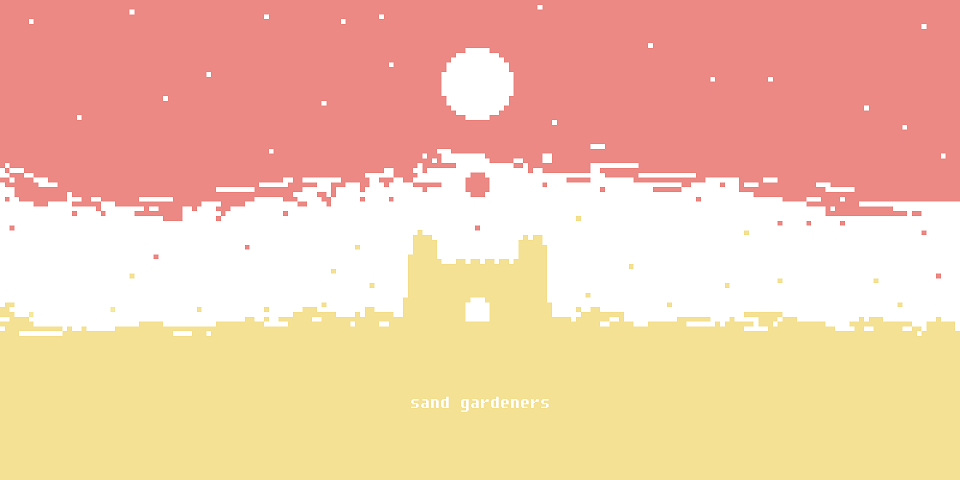
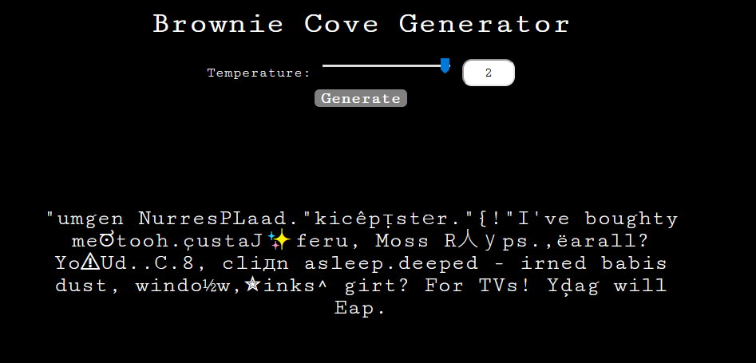

>
>To the extent possible under law, the person who associated CC0 with this work has waived all copyright and related or neighboring rights to this work. 

# [📖Brownie Cove Generator - random-word-generator📖](https://sandgardeners.itch.io/generator)

At Sand Gardeners, our projects are mostly powered by free and/or open source initiatives, including but not limited to [Inkle's Ink](https://github.com/inkle/ink), [Twine](https://github.com/tweecode/twine), [Bitsy](https://github.com/le-doux/bitsy). Likewise, the content we produce is deeply inspired by other artists who came before us, and coexist with us as well. 
  
Right now, in a period of blossoming connectivity and overabundant information, we live in a time where more people than ever have the ability to express themselves creatively. But sadly, the ongoing tenacity from shareholders, copyright owners and general public assholes to silence these voices, indefinitely extend copyright laws, stifle creativity, and sue smaller creators has never been so strong.
  
Therefore, according to our will to encourage the free flow of art and ideas, we are releasing the source code and assets of all our released projects under the [Creative Commons Zero license](https://creativecommons.org/publicdomain/zero/1.0/).

We will always encourage and stand behind the creation of derivative works, mutations, and modifications, and we hope this public domain waiver will help creators in the realization of their art.

Please feel free to reuse and/or modify any part of these projects (code, sprites, models, audio) that can be useful for your personal or commercial projects. Only the Sand Gardeners logo and name, as well as the third-party assets and code we do not own are not released under the CC0 license.

We understand that we are only small fish, but as a declaration of intent and philosophy, we hope this plays a part in the creation of something new. And if you happen to make anything out of our work, tell us! [We want to hear from you! :)](mailto:sandgardeners@gmail.com)

> We tried our best to remove everything we weren't allowed to distribute. However, if we made any mistake, please let us know, we'll gladly remove any unauthorized content.